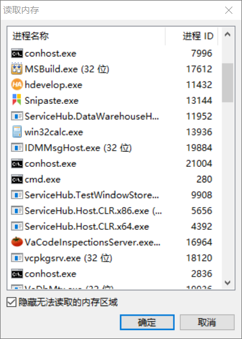

# Halcon研究(2):基于AVX2指令集仿Halcon threshold函数
上篇解剖了一下Halcon的Region结构，Region中包含了区域信息(游程编码)，也包含了一系列特征信息(面积、中心、外接矩形坐标、长宽、比例等)。Halcon的二值函数threshold得到结果也是Region结构体,这篇就仿写个threshold函数，得到结果是我们自定义的一个Region。

在开始自定义Region之前还是要对游程编码做一定了解的，百度头条的解释：

>行程编码（Run Length Encoding，RLE), 又称游程编码、行程长度编码、变动长度编码 等，是一种统计编码。**主要技术是检测重复的比特或字符序列，并用它们的出现次数取而代之。比较适合于二值图像的编码**，但是不适用于连续色调阁像的压缩，例如日常生活中的照 片。为了达到较好的压缩效果，有时行程编码和其他一些编码方法混合使用。
该压缩编码技术相当直观和经济，运算也相当简单，因此解压缩速度很快。RLE压缩编码尤其适用于计算机生成的图形图像，对减少存储容量很有效果。
RLE是一种压缩技术，而且这种编码技术相当直 观，也非常经济。RLE所能获得的压缩比有多大，这主要是取决于图像本身的特点.如 果图像中具有相同颜色的图像块越大，图像块数目越少，获得的压缩比就越高.反之，压 缩比就越小。
译码时按照与编码时采用的相同规则进行，还原后得到的数据与压缩前的数据完全 相同.因此，**RLE是无损压缩技术**。
```c
//基于halcon Region中的游程表示设计结构体runLength
struct runLength
{
    int16_t row;    //行坐标
    int16_t cols;   //列坐标开始
    int16_t cole;   //列坐标结束
}
```

threshold得到region的游程编码信息具体多大，图像未执行函数之前是不会知道，需在内存中临时开辟空间，至于开辟多少合适，这里比较懒的办法，开得足够大。既然游程是连续信息的统计以节约空间，抬杠一点，那最不节约的二值图像就是像素黑白相间的那种棋盘图了,假定图像宽*w*高*h*的8位二值图像,一段游程需要3个int16的大小,其最大游程码信息空间字节大小*rlesize*。嗯，这种棋盘图的游程编码内存空间是实际图像大小的3倍,比原图大多了,肯定是不会有这种毫无意义的棋盘二值图像存在的。

$$rlesize=\frac{w}{2}\times h \times3\times 2=3\times w \times h$$

根据上篇Region结构解剖，设计如下的结构体：
```c

struct region
{
    double centerRow;   //区域中心行坐标
    double centerCol;   //区域中心列坐标
    uint32_t area;      //区域面积
    int16_t row1;       //最小外接矩形左上行坐标
    int16_t col1;       //最小外接矩形左上列坐标
    int16_t row2;       //最小外接矩形右下行坐标
    int16_t col2;       //最小外接矩形右下列坐标
    int16_t width;      //最小外接矩形宽度
    int16_t height;     //最小外接矩形高度
    double ratio;       //最小外接矩形长宽比
    int runLengthCount; //总的游程数量
    runLength* pRle;    //游程信息的指针
}
```
为了提升算法效率，就不另外开辟内存存储整张过程二值图像了。二值图像转到游程信息参考了[How to speed Connected Component Labeling up with SIMD RLE algorithms](https://hal.archives-ouvertes.fr/hal-02492824/document)。

其核心思路如下图:


取出一段连续的二值像素，然后将该二值像素偏移一个位置得到另一段二值像素，然后两段像素值一一异或，所得结果即为边缘信息，然后利用连用连续坐标信息与该段边缘信息结果相与(二值为0,255)或相乘(二值为0,1)，得到的就是游程列坐标，但并非最终结果，需要将这些有用的游程坐标根据边缘信息一一左移([left packing](https://stackoverflow.com/questions/36932240/avx2-what-is-the-most-efficient-way-to-pack-left-based-on-a-mask))。


参考文章使用了SIMD指令集，left pack使用了Shuffle指令,至于Shuffle的mask值获取办法，采用了查表的方法，基于边缘信息求到**edge mask**，然后根据**edge mask**查表获取得到**shuffle mask**。
本文没有采用这种方法，因为这种方法所提取出的列坐标都挤到一块了，不方便插入行坐标，为了模仿halcon游程(row,cols,cole)的结构,本文使用了对edge mask进行BtiScan的方法，一个个获取列坐标。

自定region特征基本都是属于比较容易求得的，这些region特征可以参考Halcon的相关函数说明。
> **area_center**
> 
> The operator area_center calculates the area and the center of the input regions. The area is defined as the number of pixels of a region. The center is calculated as the mean value of the line or column coordinates, respectively, of all pixels.
> 
> *area就是区域像素总数，row/colume就是像素坐标值的均值。*
> 
> **smallest_rectangle1**
> 
> The operator smallest_rectangle1 calculates the surrounding rectangle of all input regions (parallel to the coordinate axes). The surrounding rectangle is described by the coordinates of the corner pixels (Row1,Column1,Row2,Column2). The calculation of the rectangle is based on the center coordinates of the region pixels.
> 
> *rol1、col1、row2、col2外接矩形的顶点坐标。*
> 
> **height_width_ratio**
> 
> The operator height_width_ratio calculates the surrounding rectangle of all input regions (parallel to the coordinate axes). The surrounding rectangle is described by the coordinates of the corner pixels (Row1,Column1,Row2,Column2) (see smallest_rectangle1). Based on these values, height_width_ratio computes the width, height, and aspect ratio of the smallest surrounding rectangle as follows:
> $$Width=Column2-Column1+1$$ $$Height=Row2-Row1+1$$ $$Ratio=\frac{Height}{Width}$$
> 
> *这就不多说了直接看公式了*。

NO BB了，直接Show Code。

```c
//pBuf图像指针，width图像宽度，height图像高度，step图像单行的字节数
//xs，ys检测区域左上坐标,rc_width、rc_height区域宽高
//lowVal、highVal 灰度高低阈值
//pRegion 结果Region的指针地址
void threshold_avx(uint8_t* pBuf, int width, int height, int step, int xs, int ys, int rc_width, int rc_height, uint8_t lowVal, uint8_t highVal, region* pRegion)
{
	int region_width;
    //为什么region_width要比检测区域大1，因为要右移一个字节
	if ((rc_width + 1) % 32 == 0)
	{
		region_width = rc_width + 1;
	}
	else
	{
		region_width = rc_width + 33 - (rc_width + 1) % 32;
	}
	//无耻一点，为了算法效率就不反复开辟空间了
	static runLength* pRLEData = new runLength[2500 * 5000];
	static runLength* pRLEShift = pRLEData;
	pRLEShift = pRLEData;
	uint16_t yMin = 0, yMax = 0;
	uint16_t xMin = 65535, xMax = 0;
	pRegion->runLengthCount = 0;
	pRegion->area = 0;
	uint8_t* pLineBuf = new uint8_t[region_width];
	//阈值下限
	__m256i lowDara = _mm256_set1_epi8(lowVal);
	//阈值上限
	__m256i highData = _mm256_set1_epi8(highVal);
	//列索引
	__m256i col_index = _mm256_setr_epi8(0, 1, 2, 3, 4, 5, 6, 7, 8, 9, 10, 11, 12, 13, 14, 15, 16, \
		17, 18, 19, 20, 21, 22, 23, 24, 25, 26, 27, 28, 29, 30, 31);

	double colSum = 0, rowSum = 0;
	bool bFindMin = false;
	for (int j = ys; j < ys + rc_height; j++)
	{
		memset((void*)(pLineBuf + rc_width), 0, region_width - rc_width);
		memcpy(pLineBuf, pBuf + j * step + xs, rc_width);
		//left 移位一个字节用，每行第一次右移，左边需要补零
		__m128i left = _mm_setzero_si128();
		int rowRleCount = 0;
		runLength* pRowFirst = pRLEShift;
		int countIndex = 0;
		uint16_t start_col_pos = xs;
		int ycount = 0;
		for (int i = 0; i < region_width; i += 32)
		{
			__m256i srcData = _mm256_loadu_epi8(pLineBuf + i);
			//二值操作  
			__m256i greatOrEqual = _mm256_cmpeq_epi8(_mm256_max_epu8(srcData, lowDara), srcData);
			__m256i lessOrEqual = _mm256_cmpeq_epi8(_mm256_min_epu8(srcData, highData), srcData);
			__m256i combineData = _mm256_and_si256(greatOrEqual, lessOrEqual);
			//将二值结果拆分成两个__m128i
			__m128i lowCombineData = _mm256_extractf128_si256(combineData, 0);
			__m128i highCombineData = _mm256_extractf128_si256(combineData, 1);
			//将拆分的两个128位二值结果联合相邻元素作右移后再合并
			__m256i shiftData = _mm256_setr_m128i(_mm_alignr_epi8(lowCombineData, left, 15), _mm_alignr_epi8(highCombineData, lowCombineData, 15));
			left = highCombineData;
			//统计原二值图像中255像素个数 累加起来就是区域面积
			int count255 = __popcnt(_mm256_movemask_epi8(combineData));
			pRegion->area += count255;
			ycount += count255;
			//原二值数据和偏移后的二值数据作异或得到边缘信息
			__m256i edgeRes = _mm256_xor_si256(combineData, shiftData);

			int edgeMask = _mm256_movemask_epi8(edgeRes);
			//rowRleCount += __popcnt(edgeMask);
			//位扫描偏移
			unsigned long shift_col_pos = 0;
			while (edgeMask != 0 && _BitScanForward(&shift_col_pos, edgeMask))
			{
				if (countIndex % 2 == 1)
				{
					//一段游程结束
					pRLEShift->cole = start_col_pos + shift_col_pos - 1;
					colSum += (pRLEShift->cole + pRLEShift->cols) * (pRLEShift->cole - pRLEShift->cols + 1) / 2.0;
					rowSum += (pRLEShift->cole - pRLEShift->cols + 1) * j;
					pRLEShift++;
					pRegion->runLengthCount++;
					rowRleCount++;
				}
				else
				{
					//一段游程开始
					pRLEShift->row = j;
					pRLEShift->cols = start_col_pos + shift_col_pos;
				}
				edgeMask = edgeMask & (~(1 << shift_col_pos));
				countIndex++;
			}
			start_col_pos += 32;
		}
		//求Region相关特征 
		if (rowRleCount > 0)
		{
			if (!bFindMin)
			{
				pRegion->row1 = j;
				bFindMin = true;
			}
			pRegion->row2 = j;
			if (pRowFirst->cols < pRegion->col1)
			{
				pRegion->col1 = pRowFirst->cols;
			}
			if ((pRowFirst + rowRleCount - 1)->cole > pRegion->col2)
			{
				pRegion->col2 = (pRowFirst + rowRleCount - 1)->cole;
			}
		}
	}
	pRegion->centerCol = colSum / pRegion->area;
	pRegion->centerRow = rowSum / pRegion->area;
        pRegion->width = pRegion->col2 - pRegion->col1 + 1;
	pRegion->height = pRegion->row2 - pRegion->row2 + 1;
	pRegion->ratio = pRegion->height / pRegion->width;
	if (pRegion->runLengthCount > 0)
	{
		pRegion->pRle = pRLEData;
	}
	free(pLineBuf);
	pLineBuf = nullptr;
}
```

究竟结果对不对分别在VS和Hdevelop中跑一下看看，使用Halcon示例图片bottle_crate_01.png。


结果看看对不对,Halcon:


VS:


从region这些特征来看结果都是对的，至于游程想个办法来看看，假设halcon使用的region也是如他所保存的hobj文件中一样，游程是3个int16一组组连续排列的，不过文件中是大端序保存的，而计算机内存中是小端序排列的。通过VS内存看看数据的样子，再到十六进制软件hxd中看看仿写region和halcon region在内存中排列是否一致。
观察内存，以10进制双字节查看，貌似就是游程的结果。


以16进制单字节查看


打开hxd,工具读取内存，选择hdevelop程序。



拷贝vs中内存查看器下16进制单字节的一段连续游程的结果，在hxd中搜索一下这段字节序列。


好了找到了，后续又通过hxd对自写程序的内存中游程进行了分析，懒得截图了，一模一样，看来高仿已经成功了。

结果一致性看完了，再看看效率如何，代码中资源开辟已经不讲武德，比较上再不讲点武德了，用同事的话讲叫要脸何用,自写函数在vs中跑release版本，halcon在Hdevlop中跑，版本17.12，自用笔记本配置CPU AMD R5 5600U，内存16G。
```C
        //VS中跑一千次计时
	QElapsedTimer tim1;
	tim1.start();
	for (int i = 0; i < 1000; i++)
	{
		region reg;
		threshold_avx(m_img.bits(), m_img.width(), m_img.height(), m_img.bytesPerLine(), 0, 0, m_img.width(), m_img.height(), 180, 255, &reg);
	}	
	qDebug() << "threshold execute time " << tim1.nsecsElapsed() / 1000000.0 << "ms";
```
```python
#Hdevelop中跑一千次，关掉自动并行化，将武德不讲到底
set_system('parallelize_operators','false')
read_image (Image10340191807, 'E:/bottle_crate_01.png')
for Index := 0 to 1000 by 1
threshold(Image10340191807, Region, 180, 255)
endfor
```
时间对比结果来了。


不讲武德的比Halcon快了一点。。。。。只测了一张图片，不能说明什么大问题，而且比较方式也不算公平，halcon在vc++下调用效率应该会更高。

后续继续研究一下基于游程的区域形态学操作、联通区域标记(CCL)，之前用union-find写过CCL效率真的惨不忍睹，如果大佬们有关于这些比较好的思路方案，欢迎指导。


