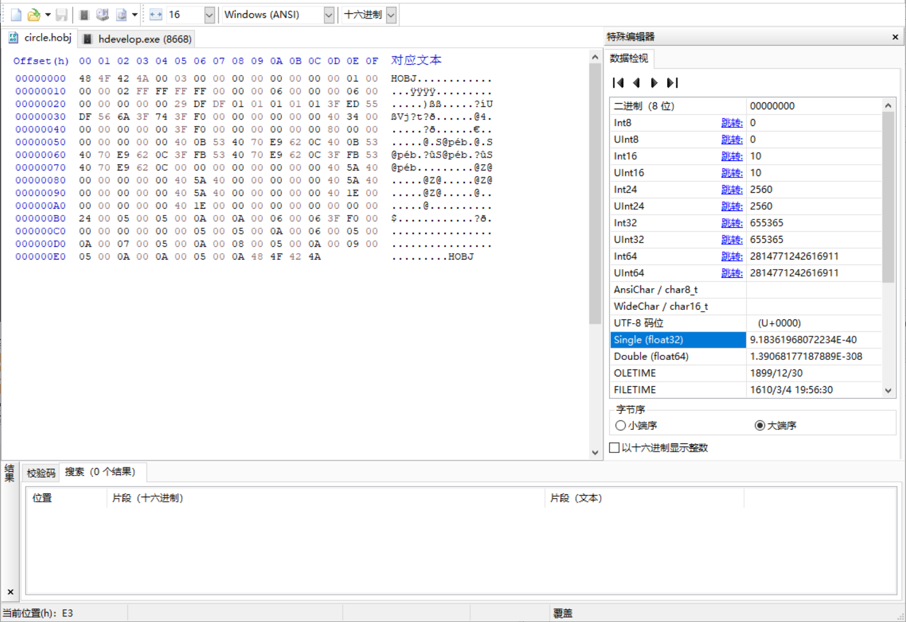
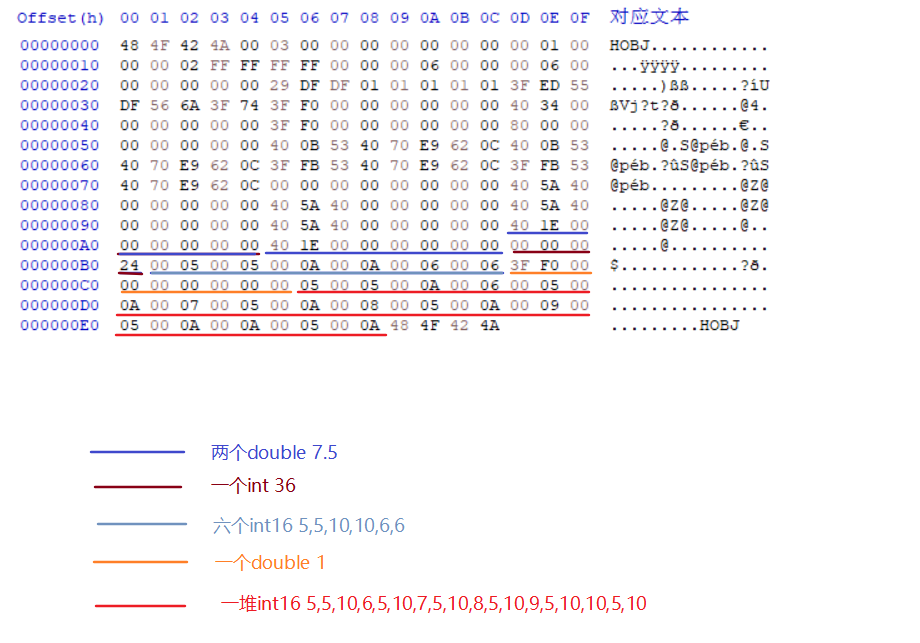
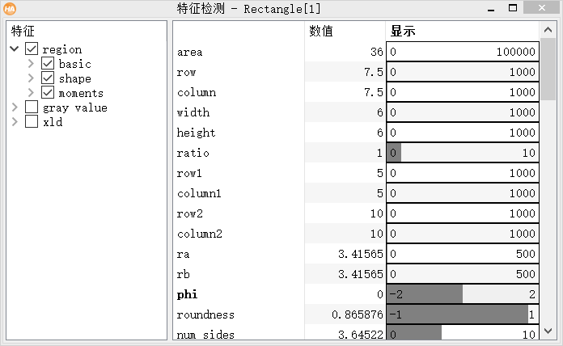

# Halcon研究(1):解剖Region
Halcon中的Region是对于区域进行描述的结构体，是非常重要的一个元素，从图像层面来说，其不具备图像灰度的信息，完全就是一个坐标的集合信息，下面我们就来解剖一下Region的结构。


通过halcon生成一个矩形区域的hobj文件，使用十六进制编辑器hxd，打开这个hobj文件。想要查看这些十六进制数据是什么，请打开大端序。
```C
//生成一个Rectangle的region并将其保存
gen_rectangle1(Rectangle, 5, 5, 10, 10)
write_region(Rectangle, 'd:/circle.hCobj')
```


解析一下这些数据吧：

> **48 4F 42 4A**(HOBJ) 00 03 00 00 00 00 00 00 00 00 01 00 00 00 02 FF FF FF FF 00 00 00 06 00 00 00 06 00 00 00 00 00 00 29 DF DF 01 01 01 01 01 3F ED 55 DF 56 6A 3F 74 3F F0 00 00 00 00 00 00 40 34 00 00 00 00 00 00 3F F0 00 00 00 00 00 00 80 00 00 00 00 00 00 00 40 0B 53 40 70 E9 62 0C 40 0B 53 40 70 E9 62 0C 3F FB 53 40 70 E9 62 0C 3F FB 53 40 70 E9 62 0C 00 00 00 00 00 00 00 00 **40 5A 40 00** (3.41015625) 00 00 00 00 **40 5A 40 00** (3.41015625) 00 00 00 00 40 5A 40 00 00 00 00 00 **40 5A 40 00 00 00 00 00** (7.5) **40 1E 00 00 00 00 00 00** (7.5) **40 1E 00 00 00 00 00 00** (7.5) 00 00 **00 24** (36) **00 05** (5) **00 05**(5) **00 0A** (10) **00 0A** (10) **00 06** (6) **00 06** (6) **3F F0 00 00 00 00 00 00** (1) **00 05** (5) **00 05** (5) **00 0A** (10) **00 06** (6) **00 05** (5) **00 0A** (10) **00 07** (7) **00 05** (5) **00 0A** (10) **00 08** (8) **00 05** (5) **00 0A** (10) **00 09** (9) **00 05** (5) **00 0A** (10) **00 0A** (10) **00 05** (5) **00 0A** (10) **48 4F 42 4A**(HOBJ)



这些数据对应了哪些东西，通过Hdevelop打开特征检测窗口看一下：



36对应了面积(area)，两个7.5分别对应了区域的中心横纵坐标(row,column)，两个6是宽和高(width,height)，double型的1应该对应了横纵比(ratio)，两个5是其最小外接矩形的左上角坐标(column1,row1)，两个10是最小外接矩形的右下坐标(column2,row2)。至于剩下的那一堆，其实就是整个区域的表示，Halcon采用了游程编码描述了该区域，每3个int16型数据是一段横向连续区域的表示，(5,5,10)-(行坐标，列坐标开始，列坐标结束)。halcon处理图像的大小官方文档中好像是32000x32000,因此认为坐标值为有符号的int16型(-32768到32767)，halcon还有个XL版，网上描述与普通halcon区别为能处理大于32000*32000大小的图像，静态所占的体积差不多，xl资源开销大，xl版中region的坐标值可能为32位。

其余还有好多数据，就懒得一一解析，其实就是Region中的各种特征。

Halcon效率非常高，不仅是其使用了指令集、自动并行化，算法设计上也有很多巧妙的地方。就比如这个Region的结构体，其实包含了很多特征信息，在使用halcon得到region结果的时候，其实算法已经计算得到了这些特征信息。除了生成区域得到region，还有用的比较多的就是二值化函数threshold，它得到的结果也是Region。

下一篇研究就是基于halcon的region结构，自行设计一个threshold函数，基于AVX2指令集.

